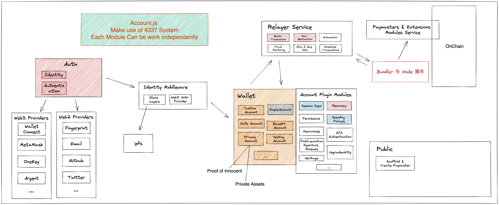

# Account.js

Unified Account Abstraction SDK & Tools for DAPP Developers.

## Packages

| Package | Description |
| ------- | ----------- |
| [accountjs-sdk](https://github.com/accountjs/account.js-next/tree/main/packages/sdk) | SDK main repo

## Architecture overview



## Playground

This project includes a [playground](https://github.com/accountjs/account.js-next/tree/main/packages/playground) with a few scripts that can be used as a starting point to use the Account.js SDK. These scripts do not cover all the functionality exposed by the SDK, but each of them present the development steps of the Account.js flow.

Update the config inside the scripts and execute the following commands to run each play:

### Deploy a account

```bash
pnpm play deploy-account
```
